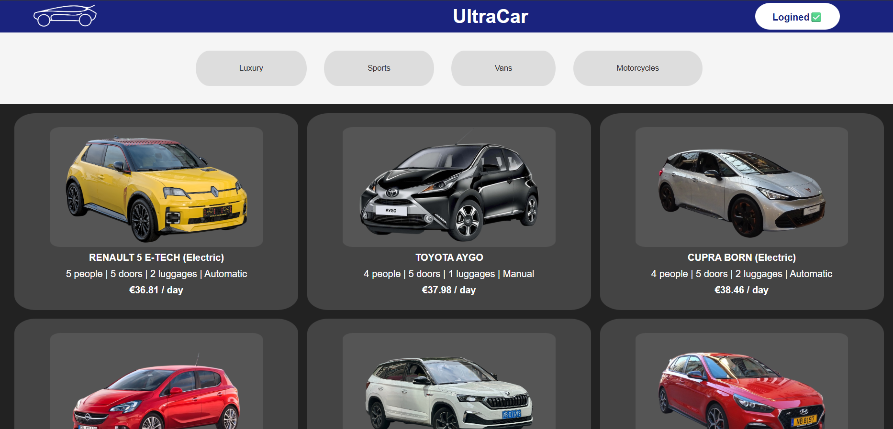

# 🚀 **Ultramarines**  
*A high-performance car rental platform built for speed, elegance, and seamless user experience.*  

---

## 👥 **Team**  
| Role                   | Member            | Class |
|------------------------|-------------------|-------|
| **Scrum Trainer**      | Artem Bok         |   8V  |
| **Front-end Developer**| Timofey Solodilov |   8G  |
| **Back-end Developer** | Timur Sunyaev     |   8B  |
| **Designer**           | Ivan Kolozenko    |   8A  |

---

## 📌 **About the Project**  
- 🏎️ **Dynamic UI**
- 🖼️ **Visual Impact**
- 💳 **Payment simulation**
- 👥 **Simulation of authorization**

---

##🛠️ **Technologies Used**
-PowerPoint

-Word

-VS Code

-Microsoft Teams

-HTML

-HTML

-CSS

-Krita

-Git

--

## 🖼️ **Screenshots**  
  

---

## 📂 **Documentation**  
- 📄 [Documentation](docs/documentation.docx)  
- 📊 [Presentation](documentation/presentation.pptx)
=======
